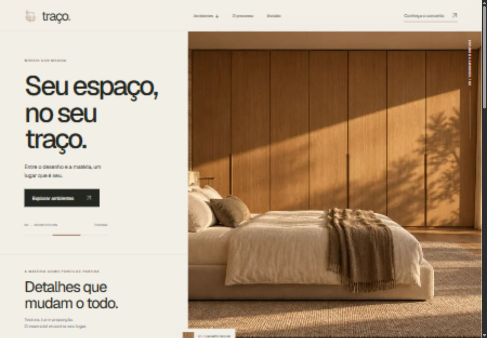
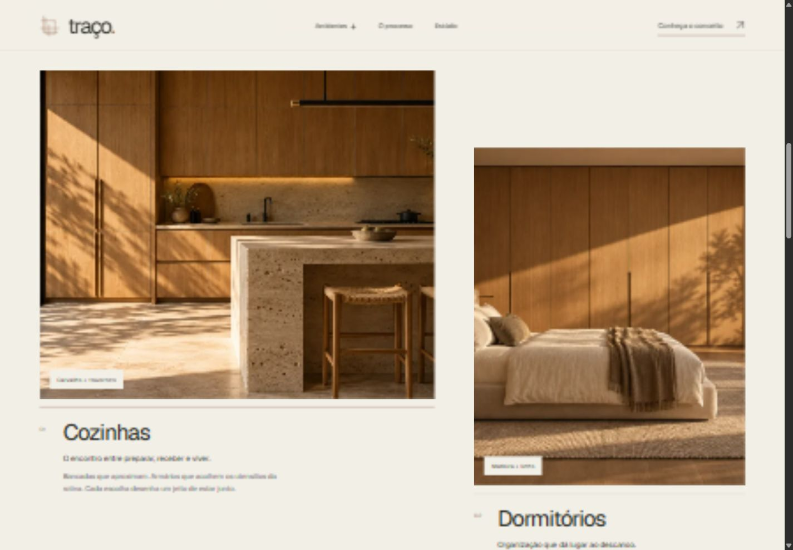
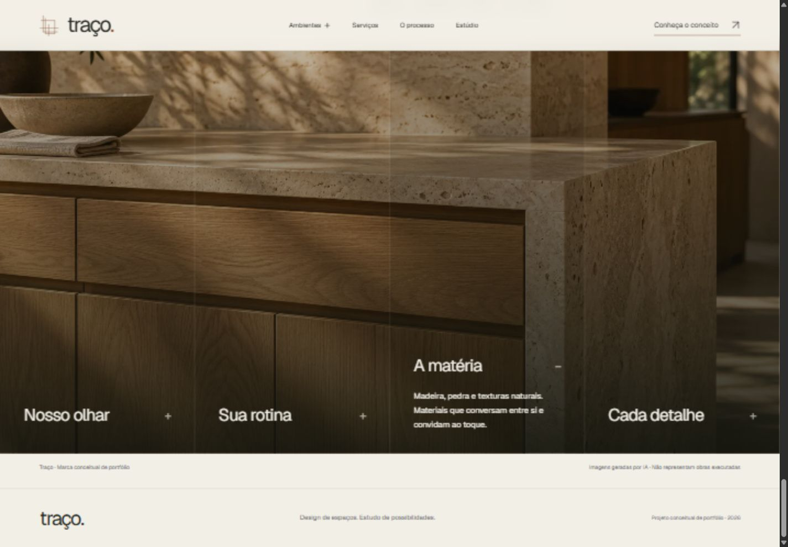
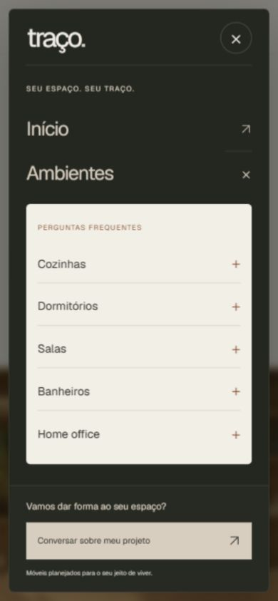

<div align="center">

# Traço — Móveis Planejados

**Seu espaço. Seu traço.**

Uma experiência digital inspirada na arquitetura, na luz e na materialidade dos ambientes sob medida.

[Conheça o site](https://tracomoveisplanejados.vercel.app) · [Explore a interface](#interface) · [Execute localmente](#executar-localmente) · [Documentação](#documentação)

**Next.js 16 · React 19 · TypeScript · Tailwind CSS 4 · Framer Motion**

</div>



## Sobre o projeto

Traço é um projeto conceitual de portfólio para uma marca fictícia de móveis planejados. A Home combina direção de arte editorial, imagens com enquadramentos por dispositivo e interações que apresentam ambientes, serviços, processo e identidade do estúdio.

A proposta visual usa marfim, carvão e cobre, tipografia Plus Jakarta Sans local e fotografias arquitetônicas geradas por IA. As imagens representam estudos de ambiente; não são registros de obras executadas por uma empresa real.

O desenvolvimento prioriza organização por seção, manutenção do conteúdo e navegação por teclado. O projeto também reúne metadados para compartilhamento e uma integração opcional de medição, condicionada às escolhas de consentimento.

## Interface

### Ambientes e identidade visual



### Estúdio e materialidade



### Navegação mobile

<p align="center">
  
</p>

> Capturas reais da interface, registradas durante o desenvolvimento em 03/10/2026. Alguns textos e detalhes podem variar em relação ao deploy mais recente.

## Funcionalidades

| Área             | Experiência                                                                           |
| ---------------- | ------------------------------------------------------------------------------------- |
| Hero             | Carrossel de cozinha, dormitório e sala, seleção manual, arraste e controle de pausa. |
| Ambientes        | Cozinhas, dormitórios, salas, banheiros e home office apresentados na própria Home.   |
| Navegação        | Submenu desktop e diálogo mobile com perguntas por ambiente e links internos.         |
| Serviços         | Apresentação visual dos serviços com conteúdo e imagens próprios da seção.            |
| Processo         | Etapas em acordeão com navegação por teclado.                                         |
| Estúdio          | Painéis interativos sobre a proposta da marca e os materiais.                         |
| Contato          | CTAs de WhatsApp com mensagens contextuais, canais sociais e acesso ao topo.          |
| Compartilhamento | Metadados Open Graph e Twitter com imagem social local.                               |
| Medição opcional | GA4, Google Ads e Meta Pixel ativados por configuração e consentimento por categoria. |

### Imagens responsivas

As imagens da aplicação são importadas de `src/assets/images` e servidas pelo otimizador do Next.js. O componente `ResponsiveImage` usa `<picture>` e fontes por breakpoint para selecionar as variantes:

| Tela                | Variante |
| ------------------- | -------- |
| Abaixo de 768 px    | Mobile   |
| De 768 a 1023 px    | Tablet   |
| A partir de 1024 px | Desktop  |

Fontes e recursos visuais da interface são locais. As capturas em `docs/readme` documentam o projeto e não são carregadas pela aplicação.

## Tecnologias

| Tecnologia                     | Papel no projeto                                                    |
| ------------------------------ | ------------------------------------------------------------------- |
| Node.js 22 / npm 11            | Ambiente de execução e gerenciamento de dependências.               |
| Next.js 16 / React 19          | App Router, composição da Home, renderização e metadados.           |
| TypeScript                     | Tipagem dos componentes, conteúdo e configurações.                  |
| CSS por seção / Tailwind CSS 4 | Tailwind para layout simples; CSS para composição fluida e efeitos. |
| Framer Motion                  | Revelações e transições da interface.                               |
| Plus Jakarta Sans variável     | Tipografia local com arquivo WOFF2 e licença junto à fonte.         |
| Biome / Prettier               | Lint e padronização de código.                                      |
| GitHub Actions                 | Verificações automáticas em pushes e pull requests.                 |
| Vercel                         | Hospedagem escolhida para a aplicação.                              |

As versões exatas estão em [package.json](package.json) e [package-lock.json](package-lock.json).

## Executar localmente

Use **Node.js 22.22.2** e **npm 11.15.0**, conforme `.node-version` e `package.json`. O intervalo de Node aceito pelo projeto é `>=22.22.2 <23`.

```bash
git clone https://github.com/agencyvbg/traco-moveis-planejados.git
cd traco-moveis-planejados
npm ci
```

Copie `.env.example` para `.env.local` na raiz com as variáveis descritas em [Configuração](#configuração).
O Next.js carrega esse arquivo automaticamente; ele é local e não entra no Git.
Em uma nova cópia do repositório, crie-o com as configurações do ambiente.

Inicie o desenvolvimento:

```bash
npm run dev
```

Acesse [localhost:3000](http://localhost:3000). Para usar outra porta, execute `npm run dev -- --port 3002`.

### Build de produção

```bash
npm run build
npm start
```

## Configuração

A configuração local fica em `.env.local`, ignorado pelo Git. As variáveis disponíveis
estão documentadas abaixo. O estado padrão mantém a indexação e a medição desativadas.
Na Vercel, configure os valores nas variáveis de ambiente do projeto; o arquivo local
não é enviado pelo repositório.

| Variável                               | Finalidade                                                                                            |
| -------------------------------------- | ----------------------------------------------------------------------------------------------------- |
| `SITE_URL`                             | Origem pública HTTPS, sem caminhos ou parâmetros. Padrão: `https://tracomoveisplanejados.vercel.app`. |
| `SITE_INDEXABLE`                       | `false` no conceito de portfólio; `true` somente após aprovação para indexação.                       |
| `GOOGLE_SITE_VERIFICATION`             | Código de verificação do domínio no Google, quando utilizado.                                         |
| `META_DOMAIN_VERIFICATION`             | Código de verificação do domínio na Meta, quando utilizado.                                           |
| `NEXT_PUBLIC_TRACKING_ENABLED`         | Habilita a integração de medição quando definido como `true` e houver IDs configurados.               |
| `NEXT_PUBLIC_GA4_ID`                   | Identificador da propriedade GA4.                                                                     |
| `NEXT_PUBLIC_GOOGLE_ADS_ID`            | Identificador da tag do Google Ads.                                                                   |
| `NEXT_PUBLIC_GOOGLE_ADS_CONTACT_LABEL` | Label da conversão de clique de contato.                                                              |
| `NEXT_PUBLIC_META_PIXEL_ID`            | Identificador do Pixel da Meta.                                                                       |
| `NEXT_PUBLIC_PRIVACY_URL`              | URL HTTPS da política de privacidade; obrigatória com medição ativa.                                  |

Variáveis `NEXT_PUBLIC_*` ficam expostas ao navegador. Credenciais privadas não devem usar esse prefixo nem ser adicionadas ao repositório. Alterações de configuração exigem novo build/deploy.

### Consentimento e eventos

Estatísticas e publicidade têm escolhas independentes. Os SDKs de Google e Meta são carregados somente após autorização da categoria correspondente; as preferências podem ser revistas pelo rodapé quando a integração está habilitada.

O projeto registra visitas e cliques contextuais de WhatsApp. Um clique representa intenção de contato; não comprova mensagem enviada, lead qualificado ou venda. A configuração completa e as condições de ativação estão em [SEO e mensuração](docs/guias/seo-e-mensuracao.md).

## Organização do código

Visão resumida dos diretórios utilizados pela aplicação:

```text
.
├── .github/workflows/     # Pipeline de qualidade
├── docs/                 # guias/, secoes/, auditorias/, marca/ e capturas do README
├── src/
│   ├── app/              # Home, Sobre, 404, erro, layout, metadados, robots e sitemap
│   ├── animations/       # Recursos compartilhados de animação
│   ├── assets/           # Imagens, marcas e fontes locais
│   ├── components/
│   │   ├── analytics/    # Consentimento e execução da medição
│   │   ├── layout/       # Header, menus e footer
│   │   ├── media/        # Imagens responsivas
│   │   └── ui/           # Elementos reutilizáveis
│   ├── config/           # Site, rotas, navegação, contato e tracking
│   ├── content/          # Conteúdo compartilhado
│   ├── lib/              # Âncoras, cliques e consultas de mídia
│   ├── sections/
│   │   ├── about/        # opening, story
│   │   └── home/         # hero, environments, services, process, studio, faq, contact
│   │                     # e services-process-transition
│   └── styles/           # Estilos globais, tokens e fontes
└── tests/unit/           # Testes de configuração, utilitários e medição
```

Cada seção reúne seus componentes, conteúdo, estilos e recursos exclusivos. `src/app/page.tsx` compõe a Home; elementos compartilhados ficam em `components`, `config` e `lib`. Consulte [arquitetura](docs/guias/arquitetura.md) e [modelo de seção](docs/guias/secao-modelo.md) para as convenções de manutenção.

### Onde editar

| Alteração                              | Local                                                   |
| -------------------------------------- | ------------------------------------------------------- |
| Nome, descrição, domínio e indexação   | `src/config/site.ts`                                    |
| Metadados e imagem de compartilhamento | `src/config/metadata.ts`                                |
| Links de navegação e categorias        | `src/config/navigation.ts`                              |
| WhatsApp e Instagram                   | `src/config/contact.ts`                                 |
| Conteúdo de uma seção                  | Arquivos `*.content.ts` em `src/sections/home`          |
| Imagens e seus registros               | `src/assets/images` e arquivos `*.images.ts` das seções |
| Cores e tokens visuais                 | `src/styles/tokens.css`                                 |
| Carrossel da Hero                      | `hero.slides.ts` e `use-hero-carousel.ts`               |

## Qualidade e acessibilidade

```bash
npm run check
npm test
npm run build
npm run audit
```

`check` reúne lint, TypeScript e verificação de formatação. A CI executa instalação pelo lockfile, essas checagens, testes de medição, auditoria de dependências e build.

A interface inclui link de salto para o conteúdo, foco visível, diálogo mobile nativo, estados acessíveis nos controles e tratamento de painéis fechados com `aria-hidden` e `inert`. O carrossel possui pausa e a implementação considera a preferência por movimento reduzido.

A [auditoria de 03/10/2026](docs/auditorias/auditoria-2026-10-03.md) registrou check e build aprovados, seis testes de medição aprovados e navegação por teclado conferida. Foram inspecionadas larguras de 320, 390, 768, 1024 e 1440 px sem overflow horizontal. Esses resultados se referem à execução documentada.

Ainda não foram realizados Lighthouse, certificação WCAG, testes com NVDA/JAWS/VoiceOver ou validação com pessoas cegas. A documentação registra as evidências e os limites das verificações.

## Publicação na Vercel

1. Conecte o repositório à Vercel e use a integração para Next.js.
2. Configure as variáveis documentadas em [Configuração](#configuração) nos ambientes apropriados da Vercel.
3. Confirme `SITE_URL` com a origem pública final, especialmente ao conectar domínio próprio.
4. Mantenha a medição desligada nos previews e a indexação desligada enquanto o site for conceitual.
5. Publique o código e confira navegação, imagens e metadados de compartilhamento no novo deploy.

Ao transformar o conceito em um site de empresa real, revise conteúdo, imagens, contatos e política de privacidade antes de habilitar indexação ou medição. O roteiro detalhado está em [SEO, compartilhamento e anúncios](docs/guias/seo-e-mensuracao.md).

## Documentação

| Documento                                                          | Conteúdo                                              |
| ------------------------------------------------------------------ | ----------------------------------------------------- |
| [Índice da documentação](docs/README.md)                           | Todos os documentos, por pasta.                       |
| [Design brief](docs/guias/design-brief.md)                         | Conceito, identidade e direção visual.                |
| [Arquitetura](docs/guias/arquitetura.md)                           | Responsabilidades e organização do código.            |
| [Modelo de seção](docs/guias/secao-modelo.md)                      | Convenções para implementar e manter seções.          |
| [Dependências](docs/guias/dependencias.md)                         | Escolhas e orientação de recursos locais.             |
| [Imagens](docs/guias/imagens.md)                                   | Organização dos recursos visuais.                     |
| [SEO e mensuração](docs/guias/seo-e-mensuracao.md)                 | Metadados, Vercel, consentimento e eventos.           |
| [Auditoria de 07/10/2026](docs/auditorias/auditoria-2026-10-07.md) | Estrutura e código: correções, decisões e pendências. |
| [Auditoria de 03/10/2026](docs/auditorias/auditoria-2026-10-03.md) | Acessibilidade técnica e evidências da Home.          |
| [Estrutura completa](docs/estrutura-completa.txt)                  | Inventário dos arquivos existentes no projeto.        |

## Autoria e uso

Desenvolvido por **[VBG Agency](https://www.instagram.com/vbgagency/)** como projeto conceitual de portfólio.

A licença da Plus Jakarta Sans está em [src/assets/fonts/plus-jakarta-sans/LICENSE](src/assets/fonts/plus-jakarta-sans/LICENSE). Este repositório não contém uma licença geral de distribuição do projeto; qualquer reutilização deve observar a autorização dos responsáveis e as licenças dos recursos envolvidos.

---

<div align="center">

**Traço — do desenho ao espaço.**

</div>
