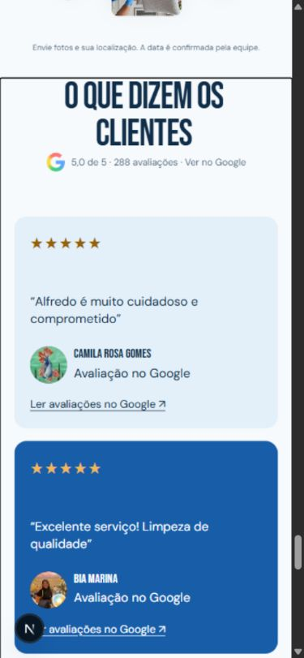
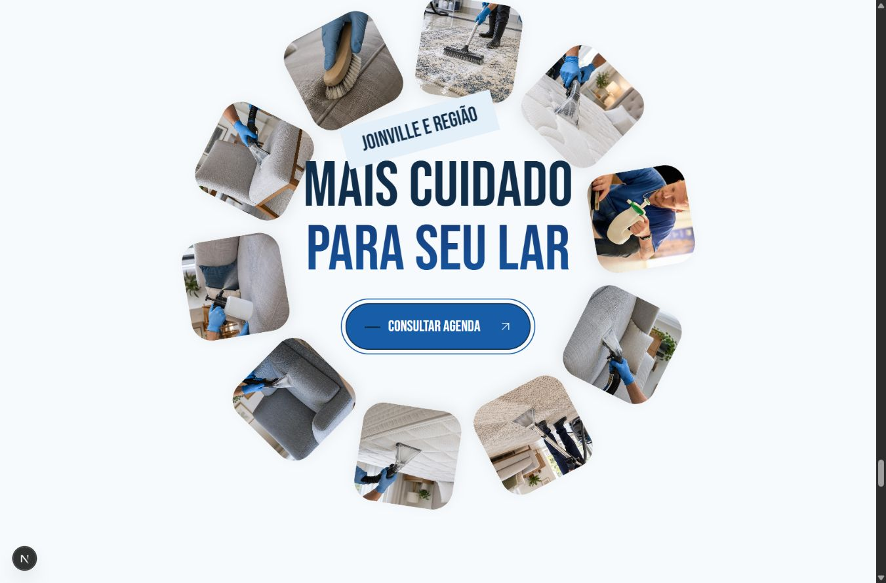
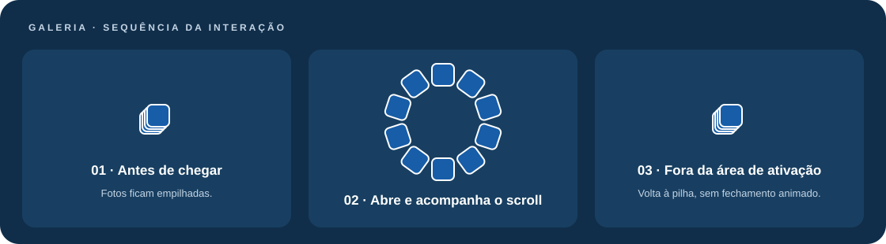
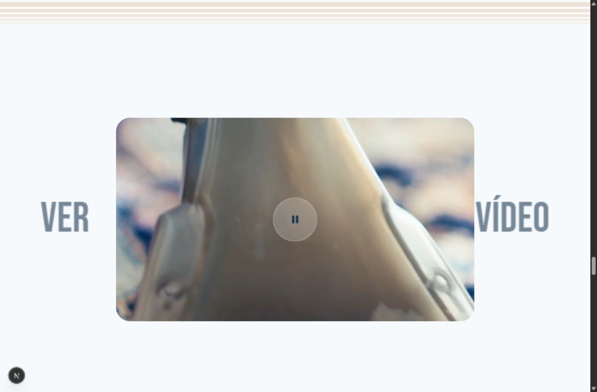
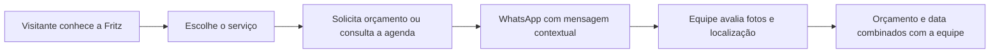
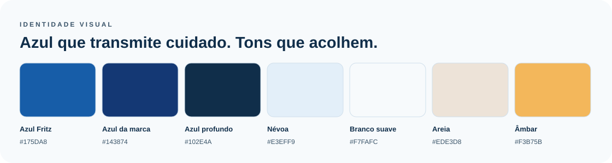
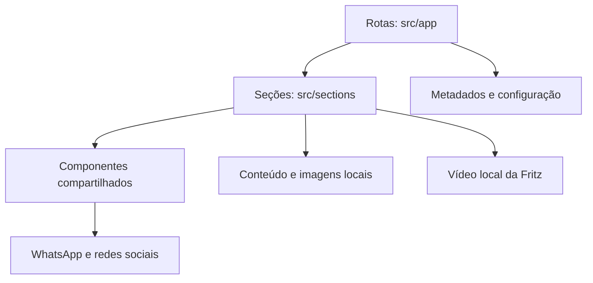

<div align="center">


# Fritz Higienização e Impermeabilização

**Mais cuidado para a sua casa.**

Site institucional com foco em higienização de estofados, apresentação dos serviços e conversão de visitas em conversas pelo WhatsApp.

[Site público](https://fritzhigienizacao.vercel.app/) · [Começar](#executar-localmente) · [Manutenção](#onde-editar) · [Publicação](#publicação) · [Documentação](#documentação)

**Next.js 16 · React 19 · TypeScript · Tailwind CSS 4 · Framer Motion · GSAP**

</div>


> As capturas documentam a versão local durante o desenvolvimento. O site publicado pode estar em uma versão anterior até o próximo deploy.

## Navegação rápida

| Conhecer o projeto                          | Trabalhar no código                             | Preparar a entrega                                |
| ------------------------------------------- | ----------------------------------------------- | ------------------------------------------------- |
| [Interface](#interface)                     | [Executar localmente](#executar-localmente)     | [SEO e compartilhamento](#seo-e-compartilhamento) |
| [Identidade visual](#identidade-visual)     | [Estrutura](#estrutura)                         | [Qualidade](#qualidade)                           |
| [Animações](#galeria-circular-e-interações) | [Onde editar](#onde-editar)                     | [Publicação](#publicação)                         |
| [Jornada de contato](#jornada-de-contato)   | [Variáveis de ambiente](#variáveis-de-ambiente) | [Checklist de entrega](#checklist-de-entrega)     |

## Sobre o projeto

A aplicação apresenta a **Fritz Higienização e Impermeabilização**, com atendimento em **Joinville e região**. O conteúdo orienta o visitante a informar o tipo de peça, enviar fotos e consultar orçamento e disponibilidade com a equipe.

O agendamento é confirmado no WhatsApp: o site não reserva horários nem processa pagamentos. As mensagens são preenchidas com o contexto do botão ou com os dados informados no formulário.

O projeto preserva a composição editorial, as transições de páginas e as interações de scroll, com identidade visual própria da Fritz. Imagens ilustrativas são identificadas como tal; depoimentos e fotos de perfil da seção de clientes têm origem no perfil público do Google.

### Serviços apresentados

| Serviço                        | Conteúdo da página                                    |
| ------------------------------ | ----------------------------------------------------- |
| Higienização de sofás          | Assentos, encostos e cuidados conforme o tecido       |
| Limpeza de tapetes             | Material, medidas e avaliação da peça                 |
| Higienização de colchões       | Revestimento, ventilação e orientações de secagem     |
| Higienização de poltronas      | Braços, assento e encosto                             |
| Impermeabilização de estofados | Compatibilidade do revestimento e proteção indicada   |
| Higienização de cadeiras       | Quantidade de peças e cuidado com assentos e encostos |

## Interface

### Apresentação da marca


### Avaliações no celular

<p align="center">
  
</p>

### Galeria circular e interações





A galeria usa dez fotos diferentes. A abertura acontece quando a **primeira foto** alcança a área central da tela, em uma animação de **1 segundo**. O círculo acompanha a rolagem com suavização; fora da área de ativação, as fotos voltam à pilha instantaneamente. Ao retornar, a entrada é reproduzida.

Em celular e tablet (até 991 px), a entrada usa a posição estável da seção. Depois de abrir, as fotos permanecem distribuídas enquanto qualquer parte da seção estiver visível. Pequenas rolagens para cima e mudanças na altura da barra do navegador não reiniciam a entrada. A galeria volta à pilha apenas depois de sair completamente da tela.

No desktop, passar o mouse sobre o conteúdo central aumenta sua opacidade e reduz o círculo a 80% em 500 ms. O foco de teclado também recebe esse tratamento. Com preferência de movimento reduzido, as fotos permanecem abertas e estáticas.

A lógica fica em [Leaders](src/sections/home/leaders/leaders.tsx), os estilos em [leaders.css](src/sections/home/leaders/leaders.css) e a comparação com a referência está registrada na [auditoria da galeria](docs/auditorias/galeria-ariyana-2026-10-08.md).

### Vídeo de serviço



O vídeo enviado pela Fritz substitui o vídeo anterior e é compartilhado pela Home e pela página de serviços. O arquivo é servido localmente em [`public/videos/fritz-servico.mp4`](public/videos/fritz-servico.mp4).

Arquivo recebido: MP4 com 5 segundos, resolução 1920 × 1080 e aproximadamente 3,84 MiB.

[Assistir ou baixar o vídeo de serviço](public/videos/fritz-servico.mp4)

O player usa reprodução em loop, áudio silenciado e `playsInline`, com controle de reproduzir/pausar. A apresentação visual acompanha o scroll. Navegadores podem restringir a reprodução automática; o botão permanece disponível para iniciar o vídeo.

## Jornada de contato



| Recurso               | Comportamento                                             |
| --------------------- | --------------------------------------------------------- |
| CTAs por serviço      | Mensagem com o serviço escolhido                          |
| Consultar agenda      | Conversa com a equipe para verificar disponibilidade      |
| Formulário de contato | Nome, e-mail opcional, telefone, cidade/bairro e mensagem |
| Solicitar orçamento   | Acrescenta serviço e preferência de horário               |
| Consulte sua região   | Envia cidade e bairro ao WhatsApp                         |
| Instagram             | Abre o perfil da Fritz                                    |
| Avaliações            | Links para conferir o perfil público no Google            |

**Contato configurado:** WhatsApp **+55 47 99905-1278** e Instagram [@higienizacaofritz](https://www.instagram.com/higienizacaofritz/). A fonte central é [`src/config/contact.ts`](src/config/contact.ts).

## Experiência e responsividade

- Hero com imagem de higienização, texto de apresentação e CTA.
- Menu completo com diálogo, navegação por teclado e estados de foco.
- Introdução com logo original e texto que escurece conforme o scroll.
- Painéis de apresentação com deslocamento horizontal.
- Etapas do atendimento em acordeão.
- Cartões de serviços e composição progressiva das imagens.
- Vídeo com animação de escala e enquadramento.
- Galeria circular de imagens e seção de avaliações.
- Transições de páginas e tratamentos para preferência de movimento reduzido.

O componente `ResponsiveImage` escolhe arquivos locais por dispositivo:

| Largura do viewport | Variante da imagem |
| ------------------- | ------------------ |
| Até 767 px          | Mobile             |
| De 768 a 1023 px    | Tablet             |
| A partir de 1024 px | Desktop            |

Os breakpoints de layout e animação podem ser diferentes dos de imagens. Ao editar CSS, verificar o arquivo da seção; não assumir que todo comportamento muda em 1024 px.

## Identidade visual



| Token          | Cor       | Aplicação                      |
| -------------- | --------- | ------------------------------ |
| `--brand`      | `#175DA8` | CTAs e destaques               |
| `--brand-logo` | `#143874` | Azul próximo ao da marca       |
| `--brand-deep` | `#102E4A` | Texto, rodapé e fundos escuros |
| `--mist`       | `#E3EFF9` | Cartões e campos claros        |
| `--paper`      | `#F7FAFC` | Fundo geral                    |
| `--sand`       | `#EDE3D8` | Fundos acolhedores             |
| `--amber`      | `#F3B75B` | CTA de agenda e detalhes       |

Os tokens ficam em [`src/styles/tokens.css`](src/styles/tokens.css). O Tailwind recebe os mesmos valores por [`src/styles/tailwind-theme.css`](src/styles/tailwind-theme.css).

**Tipografia em uso:** Bebas Neue para títulos e DM Sans para texto, carregadas localmente por `next/font/local`. As licenças ficam junto aos arquivos de fontes. O Instagram mantém seu gradiente, a marca do Google suas cores e a assinatura VBG aparece branca no rodapé.

## Tecnologias

| Tecnologia       | Versão no projeto  | Papel                                    |
| ---------------- | ------------------ | ---------------------------------------- |
| Node.js          | `>=22.22.2 <23`    | Ambiente de execução                     |
| npm              | `11.15.0`          | Gerenciamento de pacotes                 |
| Next.js          | `16.3.8`           | App Router, páginas, imagens e metadados |
| React            | `19.3.0`           | Componentes e estado                     |
| TypeScript       | `5.9.3`            | Tipagem                                  |
| Tailwind CSS     | `4.3.3`            | Utilitários com prefixo `tw:`            |
| Framer Motion    | `14.0.0`           | Transições e animações                   |
| GSAP             | `3.15.0`           | Interações de scroll                     |
| Biome / Prettier | Ver `package.json` | Lint e formatação                        |

As versões travadas estão em [`package-lock.json`](package-lock.json). Não atualizar dependências sem verificar a compatibilidade com a versão de Node do projeto.

## Executar localmente

Pré-requisitos: Node.js **22.22.2**, npm **11.15.0** e acesso à pasta do projeto.

### PowerShell

```powershell
cd C:\user\bruno\dev\clientes\higienizacoes\pasta_fritz\higienizacao_fritz
node --version
npm --version
npm ci
```

Em uma instalação nova, criar o arquivo de configuração **somente se ele ainda não existir**:

```powershell
if (-not (Test-Path -LiteralPath .env.local)) {
  Copy-Item -LiteralPath .env.example -Destination .env.local
}
npm run dev
```

Acesse [http://localhost:3000](http://localhost:3000). Para outra porta:

```powershell
npm run dev -- --port 3002
```

### Produção local

```powershell
npm run build
npm start
```

O build gera `.next/`. `npm start` depende de um build concluído. Não alterar ou versionar o conteúdo gerado em `.next/`.

## Variáveis de ambiente

O Next.js lê `.env.local` automaticamente. O modelo está em [`.env.example`](.env.example). Não versionar `.env.local` nem inserir credenciais privadas no README.

| Variável                               | Finalidade                                                                                                 |
| -------------------------------------- | ---------------------------------------------------------------------------------------------------------- |
| `SITE_URL`                             | Origem pública HTTPS, sem caminho, parâmetros ou fragmento. Padrão: `https://fritzhigienizacao.vercel.app` |
| `SITE_INDEXABLE`                       | `true` permite indexação; qualquer outro valor mantém `noindex`                                            |
| `GOOGLE_SITE_VERIFICATION`             | Código de verificação do Search Console                                                                    |
| `META_DOMAIN_VERIFICATION`             | Código de verificação de domínio da Meta                                                                   |
| `NEXT_PUBLIC_TRACKING_ENABLED`         | Ativa a infraestrutura de medição quando definido como `true`                                              |
| `NEXT_PUBLIC_GA4_ID`                   | Identificador do GA4                                                                                       |
| `NEXT_PUBLIC_GOOGLE_ADS_ID`            | Identificador do Google Ads                                                                                |
| `NEXT_PUBLIC_GOOGLE_ADS_CONTACT_LABEL` | Rótulo da conversão de contato                                                                             |
| `NEXT_PUBLIC_META_PIXEL_ID`            | Identificador do Meta Pixel                                                                                |
| `NEXT_PUBLIC_PRIVACY_URL`              | URL HTTPS da política de privacidade, exigida com medição ativa                                            |

Variáveis com prefixo `NEXT_PUBLIC_` são públicas. Alterações exigem reiniciar o servidor local ou executar um novo build/deploy, conforme o ambiente.

## SEO e compartilhamento

- Idioma da página: `pt-BR`.
- Títulos e descrições próprios para a Fritz e seus serviços.
- URLs canônicas por página, derivadas de `SITE_URL`.
- Open Graph e Twitter Cards com imagem local e dados da marca.
- Favicon e Apple Touch Icon derivados da logo da Fritz.
- Cor do navegador alinhada ao azul profundo.
- `robots.txt` e `sitemap.xml` gerados pelo App Router.
- Redirecionamentos permanentes para preservar URLs antigas.

**Estado atual de preparação:** a indexação fica desativada até `SITE_INDEXABLE=true`. Com o valor desativado, os metadados usam `noindex` e o sitemap fica vazio. Isso não promete posição ou inclusão no Google.

Na publicação, confirmar o domínio definitivo, ativar a indexação no ambiente de produção e conferir o sitemap antes de enviá-lo ao Search Console. Consulte a [documentação do Google sobre noindex](https://developers.google.com/search/docs/crawling-indexing/block-indexing).

## Estrutura

```text
.
├── .github/workflows/          # Pipeline de qualidade
├── docs/                      # Guias, auditorias e capturas
├── public/videos/             # Vídeo de serviço da Fritz
├── src/
│   ├── app/                   # Rotas, layout, ícones, robots e sitemap
│   ├── animations/            # Animações compartilhadas
│   ├── assets/
│   │   ├── fonts/             # Fontes e licenças locais
│   │   └── images/            # Fotografias, logos e avatars
│   ├── components/
│   │   ├── analytics/         # Consentimento e medição opcional
│   │   ├── layout/            # Header, footer e transições
│   │   ├── media/             # Imagens responsivas
│   │   └── ui/                # Controles e ícones
│   ├── config/                # Marca, contato, SEO, rotas e medição
│   ├── content/               # Serviços, artigos e avaliações
│   ├── lib/                   # Utilitários
│   ├── sections/              # Seções por página
│   └── styles/                # Tokens, fontes e estilos globais
└── tests/unit/                # Testes de contato, configuração e medição
```



### Páginas

| Rota               | Conteúdo                        |
| ------------------ | ------------------------------- |
| `/`                | Home e seções principais        |
| `/sobre`           | Apresentação da Fritz           |
| `/servicos`        | Serviços e vídeo                |
| `/projetos`        | Listagem de cuidados e serviços |
| `/projetos/[slug]` | Detalhes de um serviço          |
| `/blog`            | Dicas de cuidado                |
| `/blog/[slug]`     | Artigo                          |
| `/contato`         | Consulta de agenda e orçamento  |

O nome técnico `projetos` foi preservado nas URLs para manter a estrutura existente; o conteúdo apresentado ao visitante é de serviços de higienização.

## Onde editar

| Alteração                            | Arquivo ou diretório                                |
| ------------------------------------ | --------------------------------------------------- |
| Nome, domínio, descrição e indexação | `src/config/site.ts`                                |
| Metadados e imagem social            | `src/config/metadata.ts`                            |
| WhatsApp, Instagram e mensagens      | `src/config/contact.ts`                             |
| Navegação                            | `src/config/navigation.ts`                          |
| Paleta                               | `src/styles/tokens.css`                             |
| Fontes                               | `src/styles/fonts.ts`                               |
| Logo Fritz                           | `src/assets/images/shared/fritz/fritz-mark.png`     |
| Favicon e ícones do dispositivo      | `src/app/favicon.ico`, `icon.png`, `apple-icon.png` |
| Hero                                 | `src/sections/home/hero/`                           |
| Introdução e logo no conteúdo        | `src/sections/home/studio/`                         |
| Serviços e fotografias               | `src/content/projects.ts` e `src/assets/images/`    |
| Texto das seções                     | Arquivos `*.content.ts` em `src/sections/`          |
| Avaliações reais                     | `src/content/google-reviews.ts`                     |
| Origem das fotos de clientes         | `src/assets/images/shared/google-reviews/ORIGEM.md` |
| Vídeo                                | `public/videos/fritz-servico.mp4`                   |
| Player e animação do vídeo           | `src/sections/home/showreel/showreel.tsx`           |
| Formulário                           | `src/sections/contact/form/`                        |
| Artigos                              | `src/content/articles.ts`                           |
| Rodapé                               | `src/components/layout/footer/`                     |

### Trocar fotos

1. Localizar o import na seção ou no arquivo `*.images.ts`.
2. Substituir as variantes desktop, tablet e mobile, respeitando o enquadramento.
3. Atualizar o texto alternativo para descrever a imagem real.
4. Conferir as três larguras e o carregamento durante o scroll.

Não transformar imagens ilustrativas em alegações de resultado. Antes/depois, certificados e avaliações devem ter origem comprovada.

### Trocar o vídeo

Substituir `public/videos/fritz-servico.mp4` por um MP4 compatível com os navegadores alvo. Se mudar o nome, atualizar o `src` no componente `Showreel`. Conferir Home e Serviços, reprodução, pausa, proporção e uso no celular. Não remover a preferência de movimento reduzido nem os rótulos acessíveis dos controles.

### Atualizar avaliações

O número de avaliações e a nota são um retrato datado, e **não uma integração automática**. Atualizar a fonte, data de conferência e avatars apenas com dados públicos verificados. Os dados atuais e links de origem ficam em `google-reviews.ts` e `ORIGEM.md`.

## Qualidade

```powershell
npm run lint
npm run typecheck
npm run format:check
npm test
npm run build
```

| Comando         | Verificação                   |
| --------------- | ----------------------------- |
| `npm run check` | Lint, TypeScript e formatação |
| `npm test`      | Testes unitários              |
| `npm run build` | Compilação de produção        |
| `npm audit`     | Auditoria das dependências    |

A CI em [`.github/workflows/ci.yml`](.github/workflows/ci.yml) executa instalação, verificações, testes, build e auditoria em pushes e pull requests. Os testes automatizados não substituem a revisão visual.

Antes de entregar uma alteração, conferir desktop, tablet e celular; menu, hover, foco e contraste; carregamento de fotos; animações de entrada; player; mensagens de WhatsApp; links externos e metadados.

## Medição e privacidade

GA4, Google Ads e Meta Pixel são opcionais. A execução depende da configuração e das escolhas de consentimento por categoria. Sem IDs válidos ou com a chave desativada, a medição não é inicializada.

O formulário prepara uma URL do WhatsApp; ele não salva o pedido em um banco de dados da aplicação. Ao continuar, o visitante usa o serviço externo do WhatsApp. Configurar uma política de privacidade correspondente ao funcionamento real antes de ativar medição.

## Publicação

1. Conferir contatos, textos, licenças das imagens e autorização de uso do vídeo.
2. Executar as verificações e o build local.
3. Configurar o projeto de hospedagem com a versão de Node indicada.
4. Informar as variáveis de ambiente na hospedagem.
5. Definir `SITE_URL` com a origem pública definitiva.
6. Ativar `SITE_INDEXABLE=true` na produção quando o site estiver pronto.
7. Realizar o deploy e conferir páginas, ícones, vídeo, metadados e links.
8. Verificar `robots.txt`, `sitemap.xml` e a propriedade no Search Console.

**Comandos de build:** `npm ci` para instalar, `npm run build` para compilar e `npm start` para executar em um servidor Node. Na Vercel, usar o preset Next.js e as variáveis do projeto. O vídeo precisa ser enviado junto aos arquivos de `public/`.

Não alterar o remote Git automaticamente ao adaptar a marca. Confirme o destino atual com `git remote -v` antes de enviar commits: o repositório e o deploy são configurações independentes da identidade exibida no site.

## Checklist de entrega

### Conteúdo e identidade

- [ ] Logo, favicon, contatos e nome correspondem à Fritz.
- [ ] Serviços, cidades e orientações foram confirmados pela equipe.
- [ ] Fotos reais e ilustrativas estão identificadas corretamente.
- [ ] Avaliações mantêm fontes públicas e data de conferência.

### Interface e funcionamento

- [ ] Conferir desktop, tablet e celular, incluindo notebook com viewport menor.
- [ ] Testar menu, entrada e saída da galeria, vídeo e navegação entre páginas.
- [ ] Conferir foco de teclado, contraste e preferência de movimento reduzido.
- [ ] Abrir os CTAs e revisar o número e a mensagem do WhatsApp.
- [ ] Testar as duas abas do formulário com dados de demonstração.

### Publicação

- [ ] Executar lint, tipagem, formatação, testes e build.
- [ ] Definir domínio, variáveis de ambiente e configurações de indexação.
- [ ] Conferir título, descrição, canonical, imagem social e ícones no deploy.
- [ ] Verificar vídeo, robots e sitemap no endereço público.
- [ ] Registrar o commit e o endereço da versão entregue.

A lista documenta verificações para cada entrega; caixas vazias não representam testes já realizados. O agendamento continua dependendo da confirmação da equipe, e as avaliações são atualizadas manualmente.

## Problemas comuns

| Sintoma                          | O que conferir                                                          |
| -------------------------------- | ----------------------------------------------------------------------- |
| Porta 3000 ocupada               | Usar outra porta com `--port 3002`; verificar qual projeto está rodando |
| Mudança de ambiente não apareceu | Reiniciar o servidor ou refazer build/deploy                            |
| Favicon antigo                   | Confirmar os arquivos e recarregar; o navegador pode manter cache       |
| Vídeo não reproduz               | Verificar arquivo, codec, erro de carregamento e botão de reprodução    |
| Imagem desaparece                | Conferir imports, variantes, dimensões e estado da animação             |
| Google não indexa                | Verificar `SITE_INDEXABLE`, domínio, deploy e metatag robots            |
| Avaliações desatualizadas        | Atualizar manualmente o snapshot verificado                             |
| Mensagem de contato incorreta    | Revisar `src/config/contact.ts` e testar as duas abas do formulário     |

## Documentação

- [Arquitetura](docs/guias/arquitetura.md)
- [Modelo de seção](docs/guias/secao-modelo.md)
- [CSS e Tailwind](docs/guias/tailwind-e-css.md)
- [Imagens](docs/guias/imagens.md)
- [SEO e mensuração](docs/guias/seo-e-mensuracao.md)
- [Brief da paleta Fritz](docs/guias/design-brief-paleta-fritz.md)
- [Brief do conteúdo Fritz](docs/guias/design-brief-conteudo-fritz.md)
- [Brief das avaliações reais](docs/guias/design-brief-avaliacoes-fritz.md)

Alguns guias e auditorias registram etapas anteriores da base. Para o estado atual, usar os arquivos de configuração, conteúdo e este README como referência; não reaplicar textos ou marcas históricos.

## Autoria e uso dos recursos

Desenvolvimento e assinatura visual: **VBG Agency**. Marca e material de serviço: **Fritz Higienização e Impermeabilização**. Fotografias ilustrativas e registros reais têm finalidades diferentes e devem continuar identificados corretamente.

Este README não concede licença de reutilização das marcas, imagens, vídeo ou avaliações. Consulte os termos e autorizações de cada recurso antes de reutilizá-lo em outro projeto.
